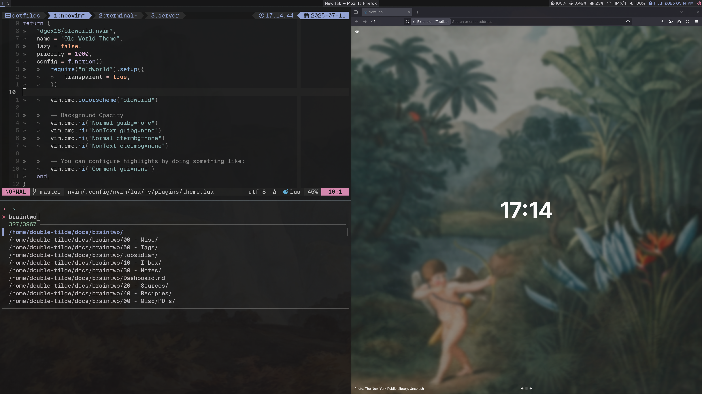
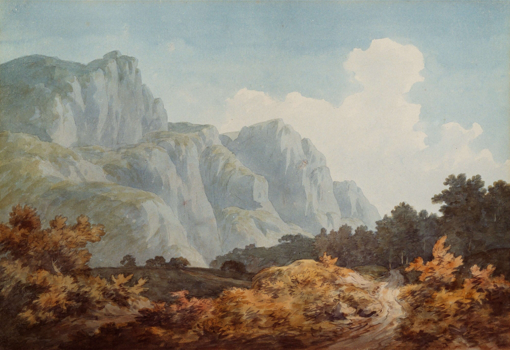

```
~~ ~~ ~~ ~~ ~~
~~ READ  ME ~~
~~ ~~ ~~ ~~ ~~
```

# My Dot Files

Here I am testing fugitive

My dotfiles based on the [Old World](https://github.com/dgox16/oldworld.nvim) colorscheme for Neovim

## Colors & Theming

- San-serif font: Karla
- Mono font: Geist Mono Nerd Font
- Mono alternative font: Hack Mono Nerd Font
- Colors: [Old World Theme](https://github.com/dgox16/oldworld.nvim)
- WSL2 folder includes these colors for the windows terminal
- Most of my background images and tabliss images come from unsplash, particularly:
    - [Tabliss wallpaper collection](https://unsplash.com/collections/74420642/victorian)
    - [British Library](https://unsplash.com/@britishlibrary)
    - [Birmingham Museum Trust](https://unsplash.com/@birminghammuseumstrust)
    - [Europeana](https://unsplash.com/@birminghammuseumstrust)



Below are some notes on what I like to install on new systems

## Install

**Terminals**

- kitty
- alacritty

**Terminal / Development Tools**

- yay (on arch based systems)
- wget
- curl
- git
- nano
- vim
- neovim
- tmux
- unzip
- ripgrep
- fd-find
- fzf
- zsh
- fastfetch
- node & npm
- rust & cargo

**Extras**

- rofi
- polybar
- betterlockscreen
- autotiling (autotiling for i3)
- dunst (notifications)
- maim (screenshots)
- pavucontrol (audio settings)
- thunar (file manager)
- nwg-look (theme settings)
- mpv & vlc (video players)
- feh (image viewing)
- obsidian (notes)
- obs-studio (screen recording)
- inkspace & gimp (photo editing)
- bitwig (audio)



```
background: #161617
foreground: #c9c7cd
background-dark: #131314
black: #27272a
subtext1: #b4b1ba
subtext2: #9f9ca6
subtext3: #8b8693
subtext4: #6c6874
red: #ea83a5
green: #90b99f
yellow: #e6b99d
purple: #aca1cf
magenta: #e29eca
orange: #f5a191
blue: #92a2d5
cyan: #85b5ba
bright_black: #353539
bright_red: #ed96b3
bright_green: #a7c8b3
bright_yellow: #eac5ae
bright_purple: #b7aed5
bright_magenta: #e8b0d4
bright_orange: #f6b0a2
bright_blue: #a7b3dd
bright_cyan: #97c0c4
dark_green: #38464e
dark_orange: #514151
dark_blue: #3e3f4f
gray0: #18181a
gray1: #1b1b1c
gray2: #2a2a2c
gray3: #313134
gray4: #3b3b3e
```
